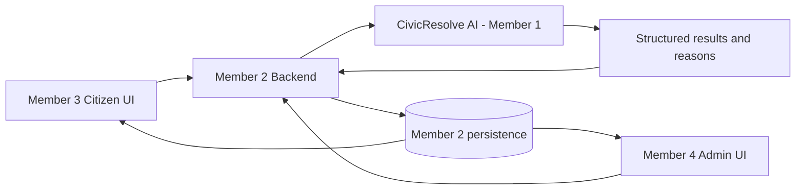

# CivicResolve AI

Member 1's AI and Agentic AI service for the CivicResolve hackathon project.

## Problem

Multiple complaints may describe the same real-world civic problem, while conventional systems often track individual tickets instead of the lifecycle of the underlying issue.

## Solution

CivicResolve AI converts citizen descriptions and photographic evidence into structured, explainable civic intelligence. It supports the issue lifecycle from complaint understanding and duplicate detection through follow-up recommendations and resolution verification.

## Member 1 Scope

This service owns stateless intelligence and recommendation contracts. It does not own the production database, candidate retrieval, scheduling, notifications, user interfaces, or final issue-state transitions. Member 2's backend supplies current data, persists results, and decides when operational actions occur.

## AI Components

1. **Complaint Understanding Agent** classifies supported complaint text with explainable deterministic rules.
2. **Vision Agent** uses local SigLIP zero-shot prompt scoring for supported visible civic issues.
3. **Civic Issue Fusion Agent** compares a new report with backend-supplied candidate Master Issues.
4. **Priority Agent** calculates an explainable priority score from severity, risk, location context, and citizen count.
5. **Routing Agent** maps recognized categories to responsible departments.
6. **Follow-up and Escalation Agent** recommends lifecycle actions from a backend-supplied issue snapshot.
7. **Resolution Verification Agent** compares before/after evidence and recommends confirmation, continued work, or human review.

## Architecture



## Current API

- `GET /health` - lightweight service health; never loads SigLIP
- `POST /analyze` - complaint understanding, priority, and routing
- `POST /duplicate-check` - deterministic candidate duplicate comparison
- `POST /classify-image` - local SigLIP whole-image classification
- `POST /follow-up` - deterministic follow-up recommendation
- `POST /verify-resolution` - local SigLIP before/after verification

The complete Member 2 request, response, error, and ownership contract is in [docs/API_CONTRACT.md](docs/API_CONTRACT.md).

## Technology

- Python 3.11+ (currently verified in the project Python 3.14 environment)
- FastAPI and Uvicorn
- Pydantic
- PyTorch and Transformers
- `google/siglip-base-patch16-224`
- Pillow
- Deterministic, explainable Python agents

No Azure, OpenAI, paid API, or API key is required.

## Local Setup

From Windows PowerShell in the repository root:

```powershell
py -3.14 -m venv .venv
.\.venv\Scripts\Activate.ps1
python -m pip install -r requirements.txt
python -m uvicorn app.main:app --reload
```

Open Swagger UI at <http://127.0.0.1:8000/docs>. Member 2 can call the service at `http://127.0.0.1:8000`.

If PowerShell blocks activation, either run the virtual-environment Python directly or use a process-scoped policy for that terminal only:

```powershell
Set-ExecutionPolicy -Scope Process -ExecutionPolicy Bypass
```

Runtime settings are standard process environment variables documented in `.env.example`. The application does not automatically load `.env`, so set overrides with `$env:NAME="value"` or through the deployment environment.

## Vision Model

Vision endpoints lazily load `google/siglip-base-patch16-224`. Model files download on first vision use when they are not already in the Hugging Face cache; later requests reuse one process-local model instance. CPU inference works and CUDA is selected when available.

All reported SigLIP values are relative zero-shot prompt scores, not calibrated municipal defect probabilities. Streetlight imagery is limited to visible physical damage and cannot prove electrical operation.

### Vision Taxonomy

The centralized prompt taxonomy implements 14 observable issue types:

- **Road:** Pothole, Cracked Road, Damaged Pavement, Broken Footpath
- **Waste Management:** Garbage Accumulation, Overflowing Bin, Illegal Dumping
- **Water:** Water Leakage, Drainage Overflow, Waterlogging, Open Drain
- **Infrastructure:** Broken Streetlight, Damaged Public Infrastructure, Broken Traffic-related Infrastructure

`taxonomy_category` and `taxonomy_issue` expose this hierarchy. The existing `category` and `issue` fields remain as backward-compatible integration labels, such as `Road Damage / Pothole` and `Drainage / Drainage Problem`.

The taxonomy and genuine SigLIP inference path are implemented for all 14 issue types. Water Leakage and Broken Streetlight retain their previously validated prompt sets. The calibrated road, waste, and drainage prompt groups must be rerun on representative real images; all other expanded types also require manual evaluation and threshold analysis.

## Testing

The unit tests use fake vision providers and do not download or load SigLIP:

```powershell
python -m unittest discover -s tests -v
python -m compileall -q app tests scripts
```

The optional real-model smoke test requires a genuine image:

```powershell
python scripts\vision_smoke_test.py sample_images\pothole.jpg
```

## Limitations

- Text understanding is keyword and rule based.
- SigLIP is zero-shot, not a custom-trained municipal defect model.
- Visual categories and provisional thresholds need broader calibrated evaluation.
- Similar visual subclasses may be rejected as ambiguous by the unchanged runner-up gate.
- Civic Issue Fusion does not yet implement image-to-image similarity.
- Prototype follow-up SLA values are not official municipal SLAs.
- Resolution verification supports evidence review but cannot guarantee physical truth or image-location identity.
- Production persistence and final lifecycle actions belong to Member 2.

## Future Work

- pgvector semantic embeddings
- PostGIS candidate retrieval in the Member 2 backend
- A specialized pothole or municipal-defect model
- Genuine image-to-image fusion
- Broader multilingual NLP
- Calibrated visual evaluation on representative civic evidence
- Cloud deployment if the team chooses it
